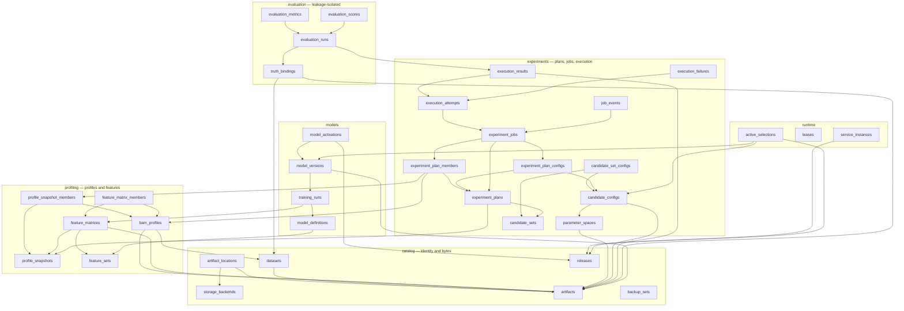
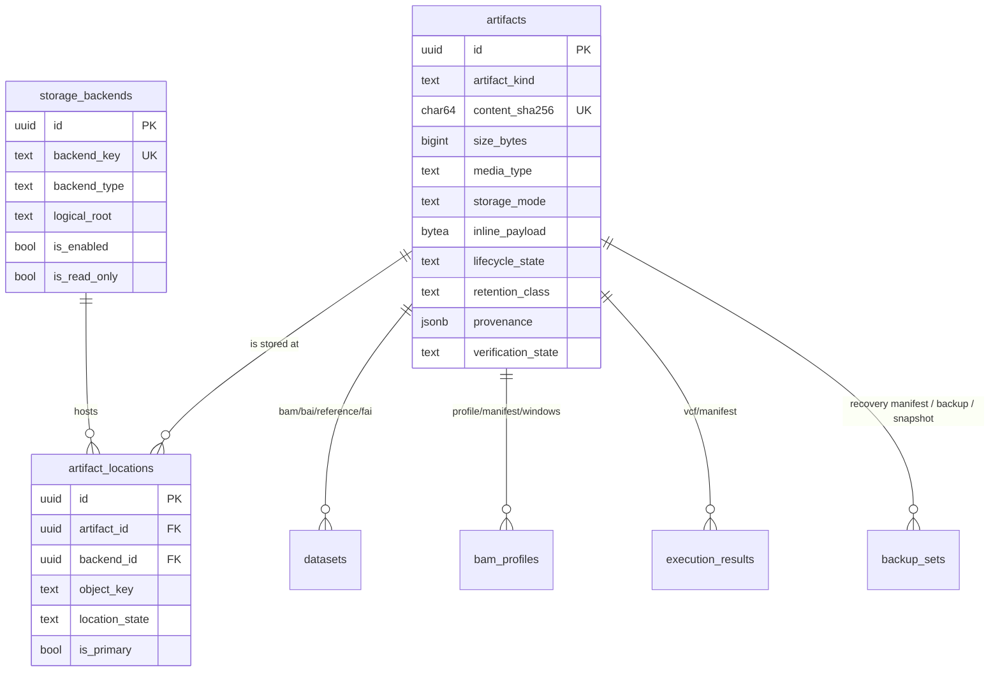
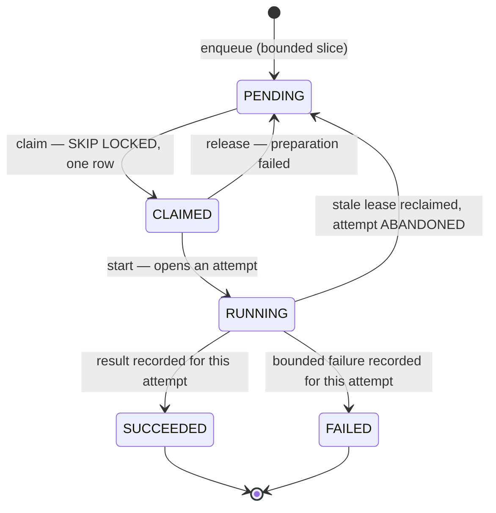
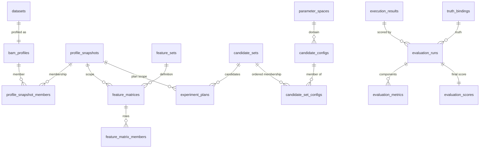

# MINOS Database V2 — Entity Relationship Diagram

Companion to [the architecture](MINOS_DATABASE_V2_ARCHITECTURE.md). Every table in
[`MINOS_DATABASE_V2_CONTRACT.json`](../../reports/database/MINOS_DATABASE_V2_CONTRACT.json)
appears here with its primary key and its important foreign keys.

Every table below is drawn under its **canonical** name — the final application contract. During
D2 the same tables are physically created in the temporary `dbv2_*` schema namespace (37 shadow
tables plus the shared `public.alembic_version`), because 9 canonical identities are already
occupied by live V1 relations. A later cutover renames the schemas so these names become real.
See [`MINOS_DATABASE_V2_PHYSICAL_DEPLOYMENT.json`](../../reports/database/MINOS_DATABASE_V2_PHYSICAL_DEPLOYMENT.json).

38 tables · 8 schemas · contract hash
`8975aa19d6f48ac4b6e6ea083b3970de0aa25162ce5ace3fbb6e57b37ca804d0`.

---

## 1. Domain map

Arrows point from the dependent table to the table it references. Only cross-domain edges are
drawn here; intra-domain detail follows in §2–§4.



**Leakage boundary.** `evaluation.truth_bindings` is the only path to truth payloads, and only
`minos_evaluator` may read it. Nothing in `experiments` references it — the execution path cannot
reach truth data even by traversal.

---

## 2. Artifact subsystem

The three-table split is what lets bytes move hosts without any scientific identity changing.



`(backend_id, object_key)` and `(artifact_id, backend_id)` are both unique. `object_key` is
constrained to be relative and free of `..`.

### 2.0 Artifacts carry a recovery scope

`catalog.artifacts.backup_scope` (`text NOT NULL`, immutable, `IN ('operational','recovery')`)
decides snapshot eligibility. `ix_artifacts_operational_snapshot` is the partial index over
`(content_sha256, size_bytes, artifact_kind) WHERE lifecycle_state = 'active' AND backup_scope =
'operational'` — the exact R1 snapshot predicate and its exact sort order.

### 2.1 Recovery sets bind three artifacts

`catalog.backup_sets` references `catalog.artifacts` three times, each by **composite** foreign
key through `uq_artifacts_id_sha_media (id, content_sha256, media_type)`, so a digest column can
never name a different artifact than its id column:

| Foreign key | Columns | Media type |
|---|---|---|
| `fk_backup_sets_recovery_manifest` | `recovery_manifest_artifact_id`, `recovery_manifest_sha256`, `recovery_manifest_media_type` | `application/vnd.minos.db-recovery-manifest+json` |
| `fk_backup_sets_database_backup` | `database_backup_artifact_id`, `database_backup_sha256`, `database_backup_media_type` | `application/vnd.postgresql.dump` |
| `fk_backup_sets_artifact_snapshot_manifest` | `artifact_snapshot_manifest_artifact_id`, `artifact_snapshot_sha256`, `artifact_snapshot_manifest_media_type` | `application/vnd.minos.artifact-snapshot+json` |

`recovery_manifest_sha256 = sha256(canonical_json_bytes(R1 manifest))`.

The artifact-snapshot triple and both counts are **nullable**, and all five are present together or
absent together (`ck_backup_sets_shape`):

| `completeness` | recovery manifest | database backup | artifact snapshot | counts |
|---|---|---|---|---|
| `complete` | required | required | required | NOT NULL, `>= 0` |
| `database_only` | required | required | NULL | NULL |

`completeness` is immutable, so the two shapes are decided at INSERT and never converted. Reaching
`'complete'` additionally requires the CONSTRAINT trigger `trg_backup_sets_shape` —
`catalog.enforce_backup_set_shape()` — to verify all three artifacts are `verified`, `active`,
`backup_scope = 'recovery'` and physically present, in the same transaction.

### 2.2 Enforcement objects

*(D2: all of these exist in the `dbv2_*` namespace on scratch PostgreSQL.)*

Relational constraints do not appear in an ERD but decide what the diagram means. See
[`MINOS_DATABASE_V2_DATABASE_API.json`](../../reports/database/MINOS_DATABASE_V2_DATABASE_API.json)
(hash `7ee16f2dd94791f7143e8b81dfbc80a6fa6d9167d78b253913f0a3bef2ab1d5c`) for the 37 functions,
89 triggers, 16 state machines and the 800-record ACL matrix that enforce this schema.

---

## 3. Job and execution model

```mermaid
erDiagram
  experiment_plans        ||--o{ experiment_plan_members : "orders"
  experiment_plans        ||--o{ experiment_plan_configs : "orders"
  experiment_plans        ||--o{ experiment_jobs         : "enumerates"
  experiment_plan_members ||--o{ experiment_jobs         : "member of"
  experiment_plan_configs ||--o{ experiment_jobs         : "config of"
  experiment_jobs         ||--o{ execution_attempts      : "attempted by"
  experiment_jobs         ||--o{ job_events              : "transitions"
  execution_attempts      ||--o| execution_results       : "succeeded as"
  execution_attempts      ||--o| execution_failures      : "failed as"

  experiment_jobs {
    uuid   id PK
    uuid   plan_id FK
    uuid   plan_member_id FK
    uuid   plan_config_id FK
    char64 job_key UK
    text   status
    int    attempt_count
    text   claimed_by
    ts     claimed_at
    ts     lease_expires_at
  }
  execution_attempts {
    uuid   id PK
    uuid   job_id FK
    int    attempt_number
    text   worker_id
    ts     started_at
    ts     finished_at
    text   outcome
    bigint runtime_ms
  }
  execution_results {
    uuid   id PK
    uuid   attempt_id FK UK
    uuid   job_id FK UK
    char64 result_hash UK
    char64 input_identity_hash
    char64 logical_argv_hash
    uuid   vcf_artifact_id FK
    uuid   manifest_artifact_id FK
  }
  execution_failures {
    uuid   id PK
    uuid   attempt_id FK UK
    uuid   job_id FK
    text   failure_code
    int    exit_code
    char64 stderr_sha256
  }
  job_events {
    uuid id PK
    uuid job_id FK
    uuid attempt_id FK
    text from_status
    text to_status
    text actor_role
    ts   occurred_at
  }
```

The composite foreign keys are what make a forged binding impossible:
`execution_results (attempt_id, job_id) → execution_attempts (id, job_id)` and
`(job_id, plan_id) → experiment_jobs (id, plan_id)`, so a result cannot name an attempt of a
different job, nor a job of a different plan.

### State machine



`CANCELLED` is unreachable. Terminal transitions run only inside the narrow `SECURITY DEFINER`
functions, each requiring its durable outcome row to exist and its `UPDATE` to affect exactly one
row.

---

## 4. Snapshot, plan and evaluation lineage



One dataset has exactly one profile (`uq_bam_profiles_dataset`). A candidate configuration is
deduplicated by `config_hash` and joined into sets through `candidate_set_configs`, so the same
configuration may belong to several candidate sets without its payload being stored twice.

---

## Critical queries

Full detail — SQL shape, cardinality, latency criticality, async eligibility and locking — is in
the contract's `critical_queries`. Index summary:

| # | Query | Index |
|---|---|---|
| Q1 | Resolve accepted dataset | `uq_datasets_key` |
| Q2 | Load snapshot membership | `ix_snapshot_members_partition` |
| Q3 | Load a feature matrix | `ix_matrix_members_matrix` |
| Q4 | Resolve configuration by ID | `pk_candidate_configs` |
| Q5 | Persist / replay a plan | `uq_plans_hash`, `uq_plan_members_index`, `uq_plan_configs_index` |
| Q6 | Bounded enqueue | `uq_jobs_job_key` |
| Q7 | Claim next pending job | `ix_jobs_claim` (partial, `WHERE status = 'PENDING'`) |
| Q8 | Start / release a claim | `pk_experiment_jobs` |
| Q9 | Record success or failure | `pk_experiment_jobs`, `uq_attempts_job_number`, `uq_results_attempt` |
| Q10 | Retrieve result + artifacts | `uq_results_job`, `ix_artifact_locations_artifact` |
| Q11 | Verify a plan graph | `ix_plan_members_plan`, `ix_plan_configs_plan`, `ix_jobs_plan_status` |
| Q12 | List stale claims | `ix_jobs_stale_leases` (partial) |
| Q13 | Reconcile artifacts | `ix_artifacts_needs_verification` (partial) |
| Q14 | Evaluate scores | `ix_evaluation_scores_ranking` |
| Q15 | Activate a model/config | `uq_model_activations_single_active`, `uq_active_selections_single` |
| Q16 | Operational health report | `ix_jobs_plan_status`, `ix_attempts_open`, `ix_backup_sets_created` |

Every index named above is declared in the contract; the validator refuses any query that cites an
index the contract does not define.
